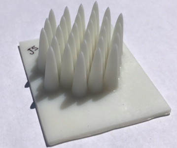

# Programme for optimizing, simulating and creating 3D printable HEDGEHOGs (3D range modulators for proton therapy)

A HEDGEHOG designed using this code to spread out a proton beam to irradiate a volume with uniform dose. 

HEDGEHOGs have been [successfully used](https://doi.org/10.1016/j.nima.2023.168243) to modulate a proton beam at TRIUMF in Vancouver, Canada.

Installation:
1. create and activate a virtual environment - makes step 4 easier.
2. clone repo with "git clone git@github.com:roddydr123/hedgehog.git".
3. install requirements using "pip install -r requirements.txt"
4. copy nist_materials.txt and nist_elements.txt into pyg4ometry package directory "pyg4ometry/geant4/".

Use runner.py as example of setting up to produce a HEDGEHOG.

 - For FLUKA simulation input generation, easiest to use 'template.inp' and change the geometry and settings from there.
    - Alternatively, look through 'template.inp' and 'gdml2f.py' for clues on the essential components.