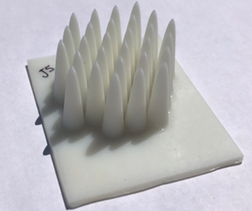
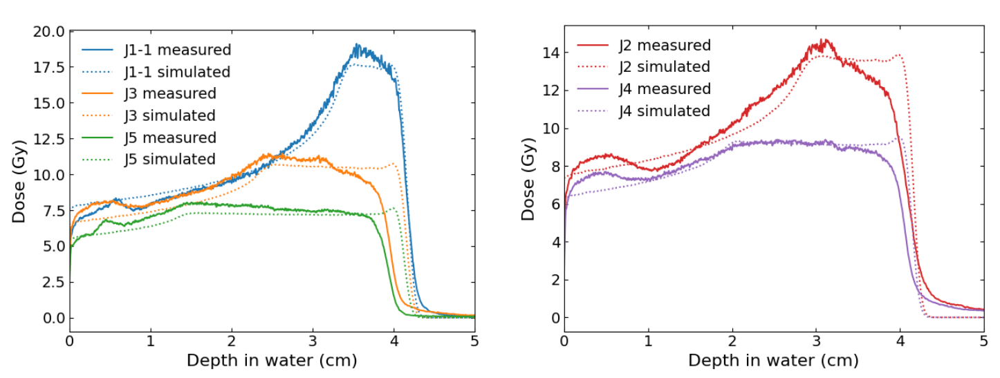
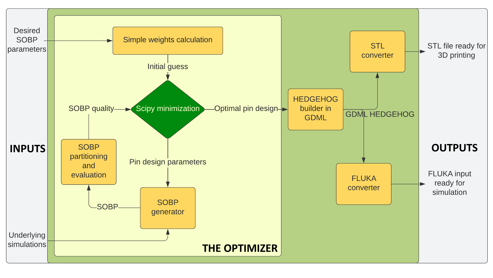

# HEDGEHOG

Design 3D printable ridge filters for proton therapy beams.



A HEDGEHOG designed using this code to spread out a proton beam to irradiate a volume with uniform dose.



HEDGEHOGs have been [successfully used](https://doi.org/10.1016/j.nima.2023.168243) to modulate a proton beam at TRIUMF in Vancouver, Canada.

## Installation
```
git clone git@github.com:roddydr123/hedgehog.git

pip install .
```

## Usage
```
thicklist = [0.1, 0.19, 0.29, 0.38, 0.47, 0.57, 0.66, 0.75, 0.85, 0.94, 1.03,
            1.13, 1.22, 1.31, 1.41, 1.5, 1.6, 1.7, 1.8, 1.9, 2.0, 2.1, 2.2,
            2.3, 2.4, 2.5, 2.6, 2.7, 2.8]

# provide path to underlying sims.
us = hog.undersim(thicklist, path/to/usims)

# provide desired SOBP details.
sobp = hog.SOBPeak(2.5, 4.0, 10)

# create hedgehog instance with location to store produced files and convergence point of optimization.
h = hog.hedgehog(sobp, us, path/to/output, tolerance=1E-3)

# uncomment to perform optimization but do not create geometry.
# h.viewDetails()

# run optimization and create a HEDGEHOG geometry.
h.generateGDML(5, 1.5, 13.6)

# convert the GDML file into a FLUKA input file with the given template.
h.gdml2f(path/to/fluka/input)

# convert the GDML file into an STL file for 3D printing.
h.gdml2stl()
```

## Code theory



## Testing

So far there are only some regression tests in `tests/initial_tests.py`:

* `test_it_runs` runs the whole HEDGEHOG creation pipeline and checks the output files exist.
* `test_gdml2f` runs the conversion of GDML geometry to FLUKA geometry and compares the output to a baseline expected result.
* `test_gdml2stl` runs the conversion of GDML geometry to STL and compares the output to a baseline expected result.
* `test_optimizer` runs the creation of the HEDGEHOG shape and compares the output to a baseline expected result.

`tests/test_utils.py` contains several functions used for checking outputs of various formats:

* `stl_same_geometry` checks if two .stl files contain the same geometry.
* `files_equal_to_ndp` checks if text files are equal with all numbers rounded to a given precision (as the same optimization run on different machines will give different results at high precision).
* `util_test_files_identical_line_by_line` checks it two text files are exactly equal. Runs line by line to give more useful error messages.
